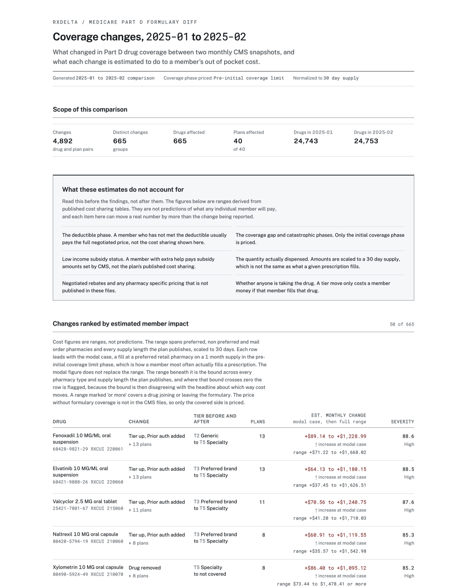

# rxdelta

Medicare drug plans publish a list every month of which drugs they cover, what
you pay for each one, and what hoops you have to clear first. Those lists change
every month, quietly, and nobody writes to tell you. A drug can move into a more
expensive payment band, or pick up a rule that your doctor has to call for
approval before the pharmacy will fill it, and the first you hear about either is
at the counter.

rxdelta compares two monthly snapshots of those files and reports what changed,
ranked by how much it is likely to cost the person filling the prescription.

## What it does

Given two monthly CMS Part D snapshots, rxdelta:

- Loads the formulary, plan information and beneficiary cost files into SQLite,
  one partition per month, with an audit trail of what came from which file.
- Classifies every change per drug and per plan: tier up, tier down, prior
  authorization added or removed, step therapy added or removed, quantity limit
  added, removed, tightened or loosened, drug added to or removed from the
  formulary. One drug and plan pair can carry several of these at once.
- Estimates what each change does to a member's cost as a **range**, never a
  single number, and leads with the most common way a prescription is actually
  filled.
- Scores each change so the ones that matter float to the top.
- Writes a self contained HTML report you can email as one file.

## Quickstart

```
git clone <this repo> && cd rxdelta
make demo
```

That is the whole setup. `make demo` generates synthetic fixtures, loads two
months, runs the comparison and opens the report. **End to end it takes 0.77
seconds** and needs no download, no credentials and no account. Requires Python
3.11 or newer and [uv](https://docs.astral.sh/uv/).

```bash
make install                      # virtualenv and dependencies
make sample                       # write two months of fixtures to data/

uv run rxdelta load --month 2025-01 --dir data
uv run rxdelta load --month 2025-02 --dir data

uv run rxdelta summary --from 2025-01 --to 2025-02   # run this first
uv run rxdelta diff    --from 2025-01 --to 2025-02 --json changes.json
uv run rxdelta report  --from 2025-01 --to 2025-02 --out report.html
uv run rxdelta status

uv run rxdelta summary --from 2025-01 --to 2025-02 --severity-distribution
```

Narrow to one contract with `--plan H1001`. Every command that produces data
takes `--json PATH`; `diff` and `summary` also take `--csv PATH`. Pass
`--frozen-timestamp` to `report` to stamp it with the compared months instead of
the wall clock, which is what the committed copies use so they do not churn.

## Two reports

Both are committed, so you can read them without running anything.

| Report | Built from | Reproducible |
| --- | --- | --- |
| [docs/example-report.html](docs/example-report.html) | Synthetic fixtures in `data/2025-01` and `data/2025-02` | Yes, by anyone, via `make example` |
| [docs/example-report-cms.html](docs/example-report-cms.html) | Real CMS files, May and June 2026 | Only with the real download |



The report is a single HTML file with no external requests: the two typefaces
are vendored as woff2 and base64 embedded at render time. It prints to US Letter
with the table header repeating on every page, stays readable at 375px, and
meets WCAG AA on every text and background pair.

Each row leads with a **modal case** figure, the change priced for a preferred
retail pharmacy on a 30 day supply in the initial coverage phase, which is how a
member most often actually fills a prescription. The full range sits underneath
as the bound across every pharmacy type and supply length. The modal figure
never replaces the range, and a row whose range crosses zero keeps its `spans
zero` flag even when the modal figure points clearly one way, because that
disagreement is the thing a reader needs to see.

Cost direction and severity are never carried by color alone: every figure is
paired with a word and every severity score with a band label, so nothing is
lost on a grayscale printout.

## What running against real data found

This project was built against `scripts/generate_sample_data.py` and only later
pointed at real CMS files: the May 2026 release (`2026_20260513`) and the June
2026 release (`2026_20260610`), 1,123,842 formulary rows each. The synthetic
fixtures had never failed. The real files failed the load seven times, and two
of those failures were bugs that had been silently corrupting every number the
project produced.

**The code mappings were wrong.** Three fields in the beneficiary cost file are
numeric codes, and `config/rxdelta.toml` had two of them mapped incorrectly.
`[impact].coverage_level` was set to `0`, chosen to mean the initial coverage
phase. Page 10 of the CMS record layout says code 0 is the **pre-deductible**
phase and code 1 is initial coverage. Every cost estimate the project had ever
produced priced the wrong phase. Separately, `DAYS_SUPPLY` code 2 was treated as
60 days when the layout says 90, so any figure on that code was normalized by 60
instead of 90 and came out **50 percent too high**. A third code list was missing
`COST_TYPE` 0 entirely, which means "not offered": its amount columns are all
zero, and reading them as a copay would have reported a free drug at 104,882
channel legs in May alone.

**Neither mapping bug was catchable with synthetic data**, and this is the
reason the exercise mattered. The generator and the config were written from the
same misreading of the record layout, so the fixture encoded the
misunderstanding and then confirmed it. Tests passed. Coverage was high. The
numbers were wrong. No amount of testing against self generated data would have
found it, because the data and the code agreed with each other and both
disagreed with CMS.

**A required column did not exist.** `ingest/schema.py` required `PLAN_TYPE` in
the plan information file. There is no such field: page 3 of the record layout
lists fourteen fields and plan type is not among them. The generator invented
the column, and the validator then demanded it of real data and refused the
load. The requirement is gone; `CONTRACT_NAME`, which is real, is stored
instead.

**Coinsurance turned out to be largely unpriceable.** A coinsurance row carries
a fraction in `COST_AMT`, not dollars, so the estimator prices it from the
`COST_MIN_AMT` and `COST_MAX_AMT` bounds CMS publishes. On the real May file,
**99,490 of 100,157 coinsurance legs publish both bounds as zero**. A zero bound
means no bound was published, not a bound of zero dollars, and the old code took
it at face value: it would have priced a 25 percent coinsurance tier at exactly
$0.00 to $0.00. Those groups are now left unpriced and the report says so. The
limitation always existed; against synthetic data, where the generator invented
populated bounds, it never showed.

**Two more shapes the fixtures never had.** The plan information file carries
one row per plan **per county**, up to 387 rows for a single plan, so 95 percent
of rows looked like duplicate keys. Identical repeats now collapse and are
counted separately, while a repeat disagreeing on any stored value is still a
rejection. And the file is **cp1252, not UTF-8**: 84 non-ASCII bytes, all of them
in Spanish plan names such as `Optimo Plus` and `Freedom Maximo`.

Nothing was loosened to make a load succeed. No accepted-values list was widened
without the record layout in hand, no coercion was added, and nothing was
wrapped in a try/except. Where the documentation genuinely has no answer, the
code declines to guess: `DAYS_SUPPLY` code 3 is documented only as "other", so it
carries no day count and rows using it stay unpriced rather than being
normalized by an invented length.

## Open questions

Stated rather than smoothed over. None of these were adjusted away.

- **104 groups share a severity of exactly 60.00.** A hard cluster on a round
  number suggests a term in the score is saturating or falling back to a default
  rather than varying. Not investigated. The formula was not touched to hide it.
- **Severity is bimodal on real data.** The 20 to 39 and 60 to 79 bands hold 79
  percent of groups. Real changes cluster into a few archetypes, mostly mass
  additions, mass removals and prior authorization added, so the score separates
  archetypes well and separates within them poorly.
- **The layout change detection path has never been triggered by data.** May and
  June 2026 are both contract year 2026 and share one record layout version. The
  schema mismatch machinery surfaced findings only because old code was pointed
  at new files, not because CMS changed anything mid-comparison.
- **5,517 of 5,518 plans were affected.** When nearly every plan is affected the
  figure stops discriminating. Plans per change group is probably the more
  informative number and the report leads with the wrong one.

## Data model

Three CMS files, one SQLite database, every fact table versioned by
`snapshot_month`.

| Table | What it holds |
| --- | --- |
| `formulary` | One row per formulary and drug: tier, prior auth, step therapy, quantity limit |
| `plan_info` | Maps a plan to the formulary it uses |
| `beneficiary_cost` | Cost sharing per plan, tier, coverage phase, supply length and pharmacy channel |
| `drug_names` | RXCUI to drug name. Reference data, not versioned by month |
| `rejected_rows` | Every row that could not be loaded, with the file, line number and reason |
| `ingest_log` | One row per source file per month: hash, row count, rejected count, load time |

The detail that trips people up: **the formulary file is keyed on formulary ID,
not on plan.** Hundreds of plans share one formulary. The plan information file
is what maps a plan to its formulary, and you have to join through it to answer
"what changed for this plan". In the real May 2026 files, 5,518 plans map onto
328 formularies.

The plan key is the triple `(contract_id, plan_id, segment_id)` and rxdelta
treats it as one unit everywhere. A contract ID alone is not a plan.

Drug codes are normalized to 11 digit NDCs with the original string kept in
`ndc_raw`. Every NDC in both real months is already unhyphenated 11 digit, so the
real rejection rate is zero; the hyphenated and ambiguous branches of the
normalizer are exercised by the synthetic fixtures.

### Drug names

Rows are identified by drug name, with the NDC and RXCUI on a secondary line.
Names come from the NLM RxNav API and are cached in
`data/reference/drug_names.csv`, which is committed. **Nothing but
`rxdelta names refresh` touches the network**, so `make demo` and every report
work offline. An RXCUI with no cached name falls back to its NDC rather than
erroring or leaving the cell blank.

```bash
uv run rxdelta names refresh            # resolve any RXCUI not already cached
uv run rxdelta names refresh --force    # refetch everything
```

## Why ingest and diff are separate packages

`rxdelta/ingest/` knows about CMS file names, column layouts, delimiters,
encodings and NDC formats. `rxdelta/diff/` knows about tiers, restrictions and
cost sharing. They share only the types in `rxdelta/types.py`, and nothing in
`diff/` imports from `ingest/`.

That split is the reusable part. The comparison and scoring logic is not really
about CMS: it is about "here are two versions of a coverage table, tell me what
changed and what it costs someone". Pointing it at a different dataset, a
commercial plan's formulary export or a state Medicaid preferred drug list,
means writing a new reader and column layout and leaves the diff untouched.

Everything tunable lives in `config/rxdelta.toml`: file name patterns, delimiter,
encoding, tier labels, the numeric code mappings, severity weights, the sort
order, the modal case definition, the rejected row ceiling and the low result
floor. No thresholds in the source.

## Performance

Measured with `scripts/benchmark.py`, never by hand, on an Apple M-series laptop
running Python 3.12.

Synthetic fixtures, 25,000 formulary rows per month, best of three runs
(`make bench`):

| Step | Time |
| --- | --- |
| Load 2025-01 (26,593 rows) | 0.28s |
| Load 2025-02 (26,593 rows) | 0.31s |
| Diff and score (4,892 changes, 665 groups) | 0.15s |
| Render report | 0.02s |
| **End to end** | **0.77s** |

Real CMS months, 1,302,746 rows per month (`make cms-bench`):

| Step | Before optimization | After |
| --- | --- | --- |
| Load 2026-05 | 16.54s | 17.18s |
| Load 2026-06 | 16.73s | 15.38s |
| Diff and score (1,030,491 changes, 1,367 groups) | 32.31s | 21.20s |
| Render report | 0.70s | 0.64s |
| **End to end** | **66.28s** | **54.39s** |

The diff got faster two ways: tier costs were being computed 2,060,982 times for
about 38,000 distinct answers and are now memoized, and SQLite discards rows that
are identical across the two months before they become Python objects, since only
0.078 percent of formulary rows differ in place. The load is parse bound and did
not get faster; the change there was to stream rows into the transaction in
chunks instead of holding the file in memory, which caps a 1.3 million row load
at 373MB of peak RSS. Loading a month twice at this scale still produces byte
identical tables.

## Limitations

The cost figures are estimates from published cost sharing tables. They do not
account for:

- The deductible phase. A member who has not met the deductible usually pays the
  full negotiated price.
- The catastrophic phase. Only the initial coverage phase is priced. The Part D
  benefit has had three phases since 2025; the coverage gap phase no longer
  exists.
- Low income subsidy status.
- The quantity actually dispensed. Figures are scaled to a 30 day supply.
- Negotiated rebates and pharmacy specific pricing not published in these files.
- Manufacturer discounts, which CMS states these files do not reflect.
- Whether anyone is actually taking the drug. A tier move only costs a member
  money if that member fills that prescription.

Beyond those, **coinsurance tiers are mostly unpriceable from this data**. CMS
publishes a fraction, not a dollar amount, and the dollar bounds that would make
it usable are published as zero on 99,490 of 100,157 coinsurance legs in the real
May 2026 file. Those rows are reported as not priced. On a specialty tier, which
is usually coinsurance, that means the report can tell you coverage changed but
not what it will cost.

This list lives in one place, `rxdelta/limitations.py`, and is rendered by both
the terminal output and the HTML report so the two cannot drift apart.

## Getting the real data yourself

The real files are **not committed**. Two months unzipped are roughly 14GB, most
of it the pharmacy networks file, and CMS redistributes them under an agreement
for use. Download them from the CMS monthly public use files page:

<https://www.cms.gov/data-research/statistics-trends-and-reports/prescription-drug-coverage-general-information/prescription-drug-plan-formulary-pharmacy-network-and-pricing-information-files>

The two months this project was validated against are the **May 2026 release
(`2026_20260513`)** and the **June 2026 release (`2026_20260610`)**. Unzip each
under `data/YYYY-MM/`. The release nests every table in its own directory and the
names contain double spaces; leave them exactly as CMS ships them, the loader
walks the tree:

```
data/2026-05/2026_20260513/basic drugs formulary file  20260531/*.txt
data/2026-05/2026_20260513/beneficiary cost file  20260531/*.txt
data/2026-05/2026_20260513/plan information  20260531/*.txt
```

Only those three tables are read. The pharmacy networks, excluded drugs,
geographic locator, indication based coverage and insulin beneficiary cost files
are ignored, as is the `sample files` directory each release ships.

```bash
make cms-load          # load both months
make cms-distribution  # does the score discriminate on real data?
make cms-example       # regenerate docs/example-report-cms.html
```

If CMS changes the record layout the load fails and names the columns that
moved, separating missing from unexpected. That failure message is the feature.

## Development

```bash
make check       # ruff, mypy strict, pytest
make coverage    # line coverage on diff/, ingest/ and names/
```

Tests run against small hand built fixture tables in `tests/fixtures/`, which
follow the real CMS column layout. CI runs lint, typecheck, tests and the full
synthetic demo on every push.

## More

[docs/METHODOLOGY.md](docs/METHODOLOGY.md) explains the cost range, the modal
case and the severity formula in plain English, with worked examples and the
verified code tables. [DECISIONS.md](DECISIONS.md) records every judgment call
and the evidence for it.

## License

MIT. See [LICENSE](LICENSE).
